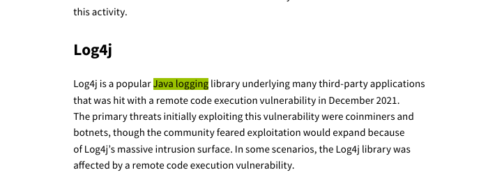
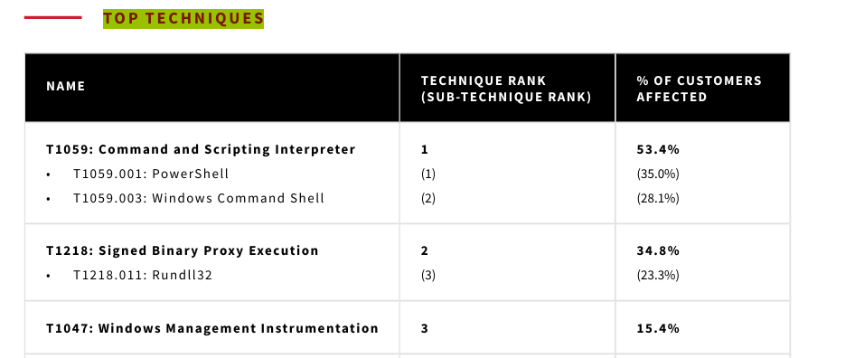
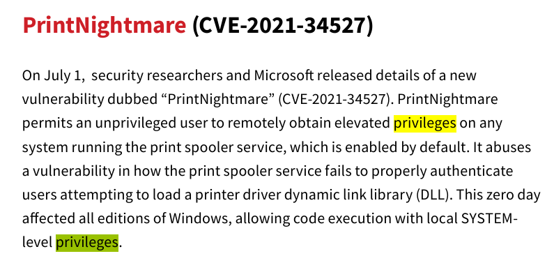

# The Report

The lab is a new type for cybersecurity labs for me, it provide thread intel report and ask you some quaiton about it.

**(Question 1) Name the supply chain attack related to Java logging library in the end of 2021 (Format: AttackNickname)**

let's search about `java logging` in the report.



```
Log4j
```

**(Question 2) Mention the MITRE Technique ID which effected more than 50% of the customers (Format: TXXXX)**

to find the answer search for `TOP TECHNIQUES`.



```
T1059
```

---
**(Question 3) Submit the names of 2 vulnerabilities belonging to Exchange Servers (Format: VulnNickname, VulnNickname)**

now to answer this we need to go to **vulnerabilities section**. will find these two vulnerabilities.

```
proxylogon,proxyshell
```

**(Question 4) Submit the CVE of the zero day vulnerability of a driver which led to RCE and gain SYSTEM privileges (Format: CVE-XXXX-XXXXX)**

to solve this we could contine read **vulnerabilities section** or search about privileges.



```
CVE-2021-34527
```

