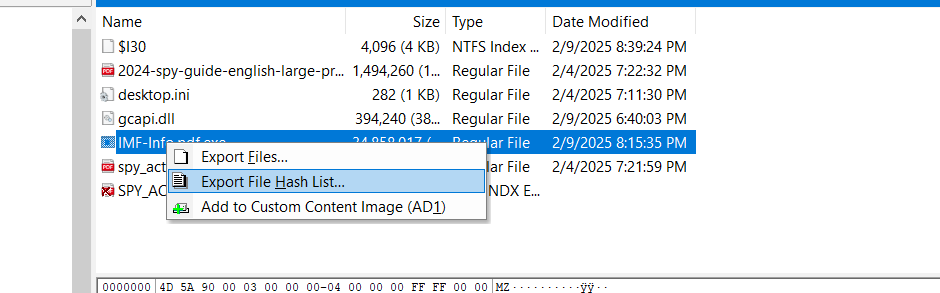
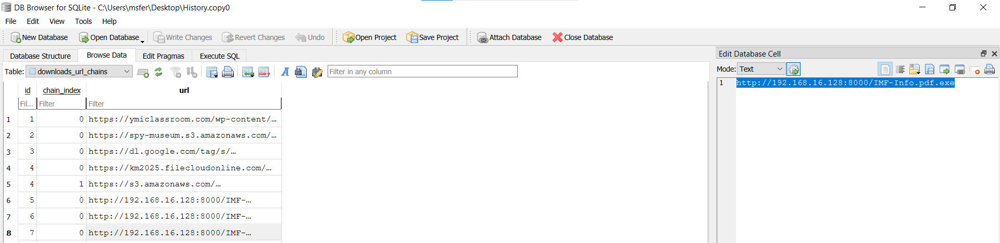

## Silent Breanch Lab

**What is the MD5 hash of the potentially malicious EXE file the user downloaded?**

let's search about malicious EXE file, first place to look is download folder.



```
336a7cf476ebc7548c93507339196abb
```


**What is the URL from which the file was downloaded?**

to finds the asnwer this, first check the browswer history, start with chrome will find history file under `C:\Users\<User>\AppData\Local\Google\Chrome\User Data\Default\History`, after some search I don't find any thing in this file.

so let's go to the edge History, you could find under `C:\Users\<User>\AppData\Local\Microsoft\Edge\User Data\Default\History`, here I find this.



```
http://192.168.16.128:8000/IMF-Info.pdf.exe
```

**What application did the user use to download this file?**

```
microsoft edge
```
