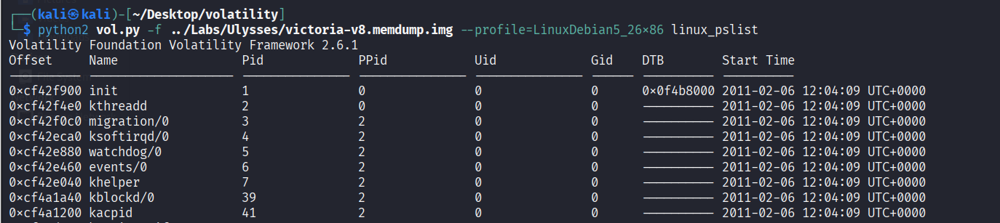

# [Ulysses](https://cyberdefenders.org/blueteam-ctf-challenges/ulysses/)

## Scenario
**A research server was flagged for suspicious activity after multiple failed authentication attempts. Analysts detected a brute-force attack, unauthorized outbound connections, and possible persistence mechanisms. Using Volatility, a custom `Debian5_26` profile was loaded to analyze memory dumps and identify malicious processes. Your task is to investigate forensic artifacts, determine the attacker's entry point, and uncover any deployed payloads.**

---

## Setup

### 1. Download Lab Files
After downloading and extracting the lab package, you will find four files:

1. **victoria-v8.kcore.img**
2. **victoria-v8.memdump.img** – memory dump
3. **victoria-v8.sda1.img** – disk image
4. **Debian5_26.zip** – Volatility profile package (to be added to Volatility 2)

---

### 2. Add Debian Profile to Volatility
Move the `Debian5_26` profile to the appropriate Volatility profiles directory.


Verify Volatility is working properly:

```
python2 vol.py -f ../Labs/Ulysses/victoria-v8.memdump.img --profile=LinuxDebian5_26x86 linux_pslist
```

  

The profile works correctly — let’s move forward.

---

### 3. Mount the Disk Image
```
sudo mkdir /mnt/debain
sudo mount victoria-v8.sda1.img /mnt/debain
```

---

## Investigation

---

### 1. The attacker was performing a Brute Force attack. What account triggered the alert?
To review login attempts, check `/var/log/auth.log` as it contains important authentication logs.

```
cat /mnt/debain/var/log/auth.log
```


```
ulysses
```

---

### 2. During investigating the logs. How many failed login attempts were alerted by the same user?
We can count failed login attempts with the `wc` command.


```
32
```

---

### 3. What kind of system runs on the targeted server?
Checking `/etc/os-release` yielded no results, so `/etc/issue` was reviewed instead.


```
Debian GNU/Linux 5.0
```

---

### 4. What is the victim's IP address?
Using Volatility’s `linux_netstat` plugin on the memory dump reveals network connections between the victim and external IPs.

```
python2 vol.py -f ../Labs/Ulysses/victoria-v8.memdump.img --profile=LinuxDebian5_26x86 linux_netstat
```


The victim’s IP is `192.168.56.102`. Two other IPs (`192.168.56.101`, `192.168.56.1`) are likely attacker addresses.

```
192.168.56.102
```

---

### 5. What are the attacker's two IP addresses?
From the previous step:

```
192.168.56.1,192.168.56.101
```

---

### 6. What is the nc service PID number that was running on the server?
From the `linux_netstat` output above, the PID is `2169`. This can be confirmed with `linux_pslist`.

```
2169
```

---

### 7. What service was exploited to gain access to the system?
List all open files and running services with `linux_lsof`:

```
python2 vol.py -f ../Labs/Ulysses/victoria-v8.memdump.img --profile=LinuxDebian5_26x86 linux_lsof
```

Many services are running, but to pinpoint the exploited one, use the `linux_bash` plugin:

```
python2 vol.py -f ../Labs/Ulysses/victoria-v8.memdump.img --profile=LinuxDebian5_26x86 linux_bash
```


This shows activity involving `exim4`. Reviewing `/mnt/debain/var/log/exim4/mainlog` and `/mnt/debain/var/log/exim4/rejectlog` confirms a buffer overflow attack targeting `exim4`.

```
exim4
```

---

### 8. What is the CVE number of exploited vulnerability?
Researching Exim4 buffer overflow vulnerabilities before 2012 reveals `CVE-2010-4344` and `CVE-2010-4345`. The relevant one for this attack is:

```
CVE-2010-4344
```

---

### 9. During this attack, the attacker downloaded two files to the server. Provide the name of the compressed file.
From `/mnt/debain/var/log/exim4/mainlog`, multiple `wget` commands appear. These indicate files downloaded to `/tmp/`.


One compressed file is found in `/tmp/` and confirmed in the `mainlog`.


```
rk.tar
```

---

### 10. During the investigation, two ports were involved in the process of data exfiltration. Which port did the nc command use for the exfiltration?
From the earlier `linux_netstat` output:


```
8888
```

---

### 11. Which port did the attacker try to block on the firewall?
Extracting `rk.tar` reveals:

```
rk/
rk/procps/
rk/procps/watch
rk/procps/w
rk/procps/vmstat
rk/procps/skill
rk/procps/snice
rk/procps/top
rk/procps/tload
rk/procps/slabtop
rk/procps/ps
rk/procps/sysctl
rk/procps/uptime
rk/procps/pwdx
rk/procps/kill
rk/procps/free
rk/procps/pgrep
rk/procps/pkill
rk/procps/pmap
rk/mig
rk/dropbear
rk/vars.sh
rk/install.sh
```

Inspecting `install.sh` reveals the answer.


```
45295
```

---
