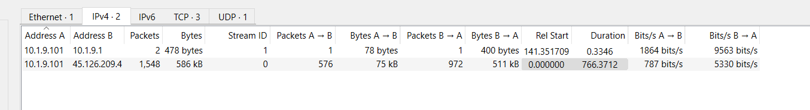
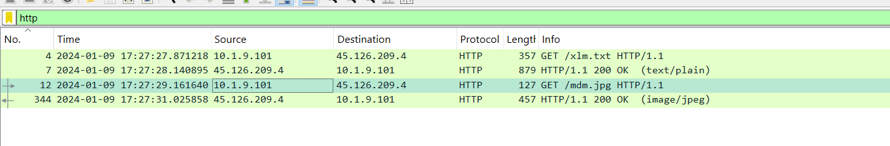
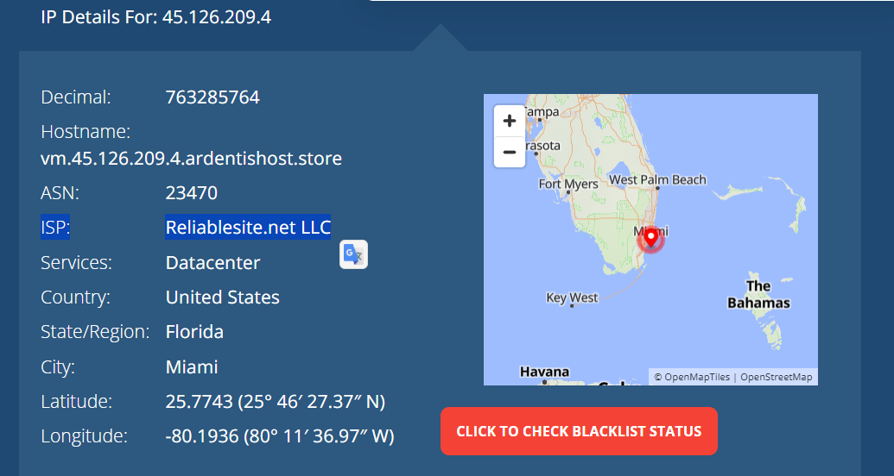
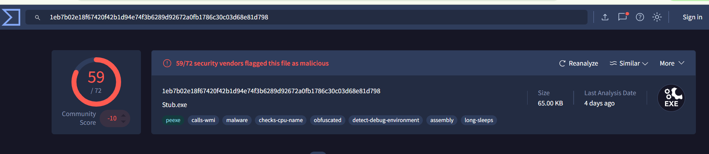
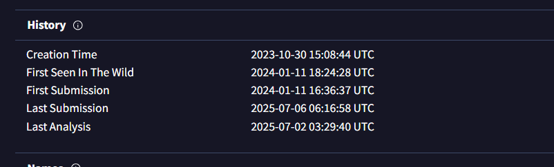
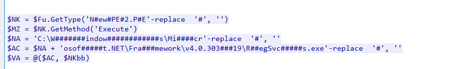

# XMLRat Lab

first downlaod lab file and unzip it, will find pcap file let's open it and see some basic info.

1. Conversion



- `10.1.9.101` like to be comprmsied machine ip
- `10.1.9.1` like to be router ip
- `45.126.209.4` like to be C2 server ip, ensure after ckeck virustotal

**The attacker successfully executed a command to download the first stage of the malware. What is the URL from which the first malware stage was installed?**

from http traffic we could know the answer.



```
http://45.126.209.4:222/mdm.jpg
```

**Which hosting provider owns the associated IP address?**

look for ip address lookup for C2 ip.


```
Reliablesite.net
```

**By analyzing the malicious scripts, two payloads were identified: a loader and a secondary executable. What is the SHA256 of the malware executable?**

if you look on virustotal about the file relate to C2 server, will see malware.exe file and sha256 is match required.



```
1eb7b02e18f67420f42b1d94e74f3b6289d92672a0fb1786c30c03d68e81d798
```

**What is the malware family label based on Alibaba?**

```
AsyncRat
```

**What is the timestamp of the malware's creation?**



```
2023-10-30 15:08:44
```

**Which LOLBin is leveraged for stealthy process execution in this script? Provide the full path.**

if you anaysis powershell scritp in the end of mdm.jpg will find the answer.



```
C:\Windows\Microsoft.NET\Framework\v4.0.30319\RegSvcs.exe
```

**The script is designed to drop several files. List the names of the files dropped by the script.**

contine anaysis mdm.jpg file and will find the answer.
# XMLRat Lab

First, download the lab file and unzip it. You will find a PCAP file—open it to review some basic information.

## 1. Conversion


- `10.1.9.101` appears to be the compromised machine's IP.
- `10.1.9.1` appears to be the router's IP.
- `45.126.209.4` appears to be the C2 server's IP (verify on VirusTotal).

**The attacker successfully executed a command to download the first stage of the malware. What is the URL from which the first malware stage was installed?**

From HTTP traffic, we can determine the answer.


```
http://45.126.209.4:222/mdm.jpg
```

**Which hosting provider owns the associated IP address?**

Look up the C2 IP address.


```
Reliablesite.net
```

**By analyzing the malicious scripts, two payloads were identified: a loader and a secondary executable. What is the SHA256 of the malware executable?**

If you check VirusTotal for the file related to the C2 server, you will see a `malware.exe` file with the matching SHA256.


```
1eb7b02e18f67420f42b1d94e74f3b6289d92672a0fb1786c30c03d68e81d798
```

**What is the malware family label based on Alibaba?**

```
AsyncRat
```

**What is the timestamp of the malware's creation?**


```
2023-10-30 15:08:44
```

**Which LOLBin is leveraged for stealthy process execution in this script? Provide the full path.**

If you analyze the PowerShell script at the end of `mdm.jpg`, you will find the answer.


```
C:\Windows\Microsoft.NET\Framework\v4.0.30319\RegSvcs.exe
```

**The script is designed to drop several files. List the names of the files dropped by the script.**

Continue analyzing the `mdm.jpg` file to find the answer.

```
Conted.ps1, Conted.bat, Conted.vbs
```

