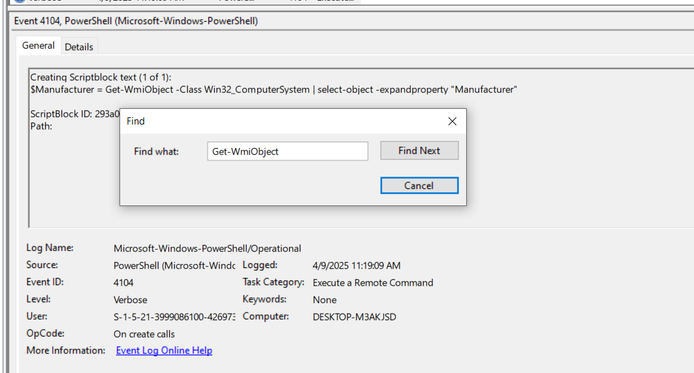
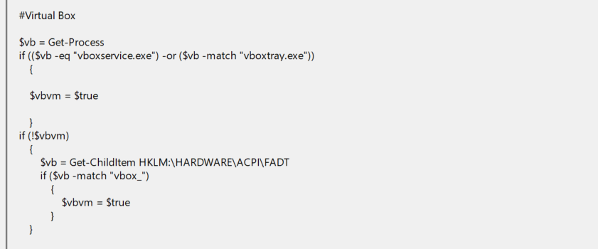
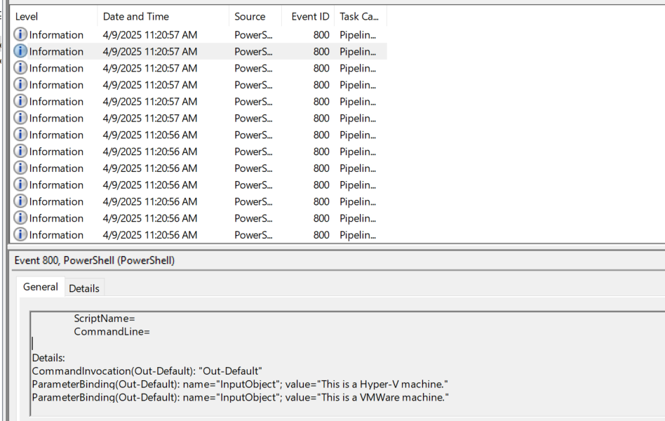

## Phantom Check Walkthrough

This guide explains how to analyze PowerShell event logs to answer virtualization detection questions.

### 1. Setup

First, download and extract the lab files. You will find two files:

- `Microsoft-Windows-Powershell.evtx`
- `Windows-Powershell-Operational.evtx`

---

### 2. WMI Class for Model and Manufacturer

**Question:** Which WMI class did the attacker use to retrieve model and manufacturer information for virtualization detection?

The attacker used the following PowerShell command:

```powershell
Get-WmiObject
```

Searching for this command reveals the relevant WMI class:

```plaintext
Win32_ComputerSystem
```



---

### 3. WMI Query for Temperature

**Question:** Which WMI query did the attacker execute to retrieve the current temperature value of the machine?

By examining further `Get-WmiObject` usage, we find:

```sql
SELECT * FROM MSAcpi_ThermalZoneTemperature
```

---

### 4. PowerShell Script Function Name

**Question:** The attacker loaded a PowerShell script to detect virtualization. What is the function name of the script?

Filtering for event ID `4104` in the logs, we find the function:

```plaintext
Check-VM
```

---

### 5. Registry Key Queried by the Script

**Question:** Which registry key did the above script query to retrieve service details for virtualization detection?

The script queries the following registry key:

```plaintext
HKLM:\SYSTEM\ControlSet001\Services
```


---

### 6. Processes Checked for VirtualBox

**Question:** The VM detection script can also identify VirtualBox. Which processes is it comparing to determine if the system is running VirtualBox?

Within the script, it checks for these processes:

```plaintext
vboxservice.exe, vboxtray.exe
```



---

### 7. Detected Virtualization Platforms

**Question:** The VM detection script prints any detection with the prefix 'This is a'. Which two virtualization platforms did the script detect?

By filtering for event ID `800` in `Microsoft-Windows-Powershell.evtx`, we see:

```plaintext
Hyper-V, Vmware
```



---

**End of Walkthrough**