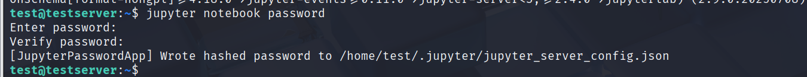
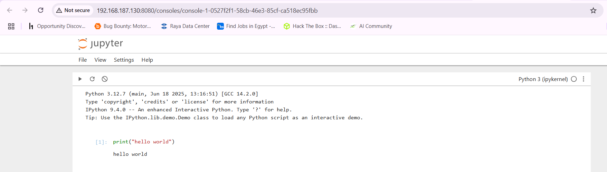

# Jupyter Lab installation

## install jupyter notebook

```
pip install jupyter
```

**also install jupyter lab**

```
pip install jupyterlab
```

## Set Password

```
jupyter notebook password
```




## Lunch Jupyter

```
jupyter notebook --ip='*' --port=8080 --no-browser
```


## Run Jupyter on Remote machine

