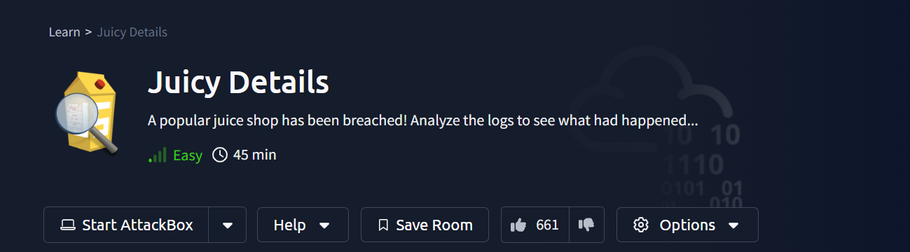
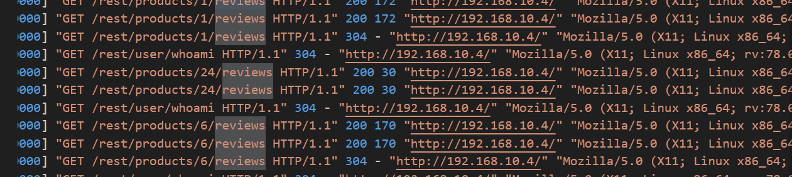
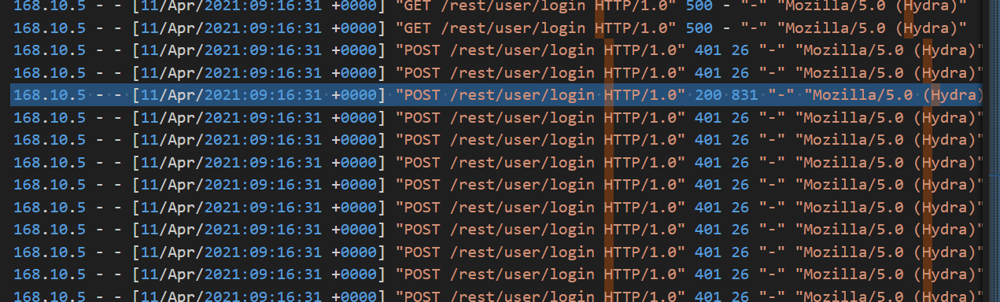

## Introduction

AFter donwload lab zip file and extact it will find.
- access.log
- auth.log
- vsftpd.log

**Are you ready?**
```
Answer: I am ready!
```

## Reconnaissance

start with access.log, after I look into it i find so intered things.
- Search for some **Nmap** scripts
- brute force on `/rest/user/login` page using **Hydra**
- SQL injection attack on `/rest/products/search` using **sqlmap**
- also used **curl** to download respose for some payload
- and last used **foroxbuster** enumeration

now let's look to the first question.

**1. What tools did the attacker use? (Order by the occurrence in the log)**
```ymal
Nmap,Hydra,sqlmap,curl,foroxbuster
```

**2. What endpoint was vulnerable to a brute-force attack?**
```ymal
/rest/user/login
```

**3. What endpoint was vulnerable to SQL injection?**
```ymal
/rest/products/search
```

**4. What parameter was used for the SQL injection?**
```ymal
q
```

**5. What endpoint did the attacker try to use to retrieve files? (Include the /)**
```ymal
/ftp
```

## Stolen data

**6. What section of the website did the attacker use to scrape user email addresses?**

by look at hint and access log will see some thing relate.


```
product reviews
```

**7. Was their brute-force attack successful? If so, what is the timestamp of the successful login? (Yay/Nay, 11/Apr/2021:09:xx:xx +0000)**

if you look well at hydra brute force attack will see one requete get response **200**, the mean that is success to login.



```
Yay, 11/Apr/2021:09:16:31 +0000
```

**8. What user information was the attacker able to retrieve from the endpoint vulnerable to SQL injection?**
```
email, password
```


**9. What files did they try to download from the vulnerable endpoint? (endpoint from the previous task, question #5)**
```
coupons_2013.md.bak, www-data.bak
```

**10. What service and account name were used to retrieve files from the previous question? (service, username)**
```
ftp, anonymous
```

**11. What service and username were used to gain shell access to the server? (service, username)**
```
ssh, www-data
```