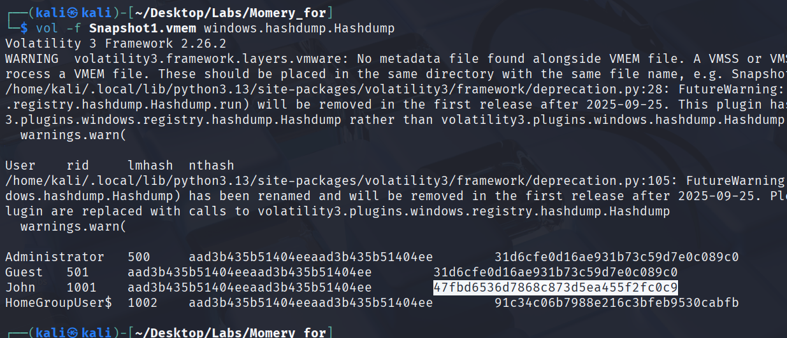

# Memory Forensics

before we start solve this lab, we need to ensure that we install volatiliy 3 and some python libaraies
 - pycryptodome
 - 

## Login

**What is John's password?**

first we need to extrack hashdump from memory image, we could do this by:
```
vol -f Snapshot1.vmem windows.hashdump.Hashdump 
```



```
charmander999
```


